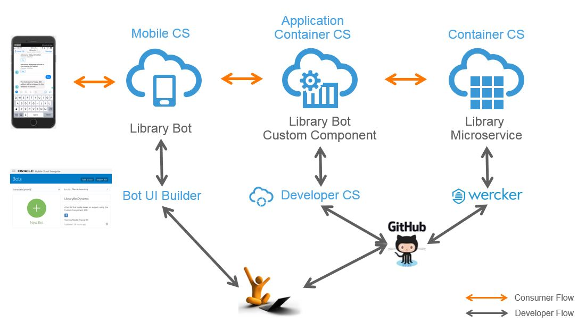
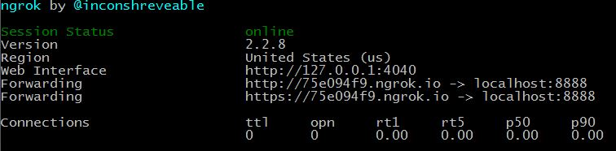
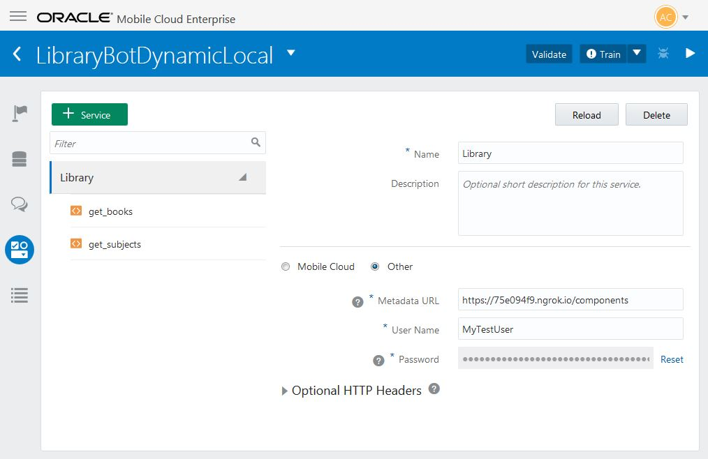

# Library Service Intelligent Bot Custom Component (Express.js)

Now that Oracle has launched it's intelligent chatbot service, I wanted to extend my [Developing, Integrating and Protecting Vendor Neutral Microservices Demo Script](https://github.com/OracleNATD/vendor-neutral-microservices) to include a messaging interface. 

In summary, that demo microservice, which I often refer to as the Library service, allows you to search for books matching a particular discipline (e.g., Astronomy). Being a vendor neutral microservice, it can run anywhere. For this example I have it running on [Oracle's Container Cloud Service](https://cloud.oracle.com/container-opc).

Development of the bot involved using the Bot UI Builder to design the flow, along with the custom component SDK to interact with my Library service. The entire solution looks like this:

This Component Service implementation is based on Express.js. It includes the following files:

- [package.json](package.json) --  This is a standard `package.json` file.
- [index.js](index.js) --  The main Javascript file. It implements the Bots Component Service REST API by  delegating most of the functions to the [shell.js](shell.js) object.
- [registry.js](registry.js) --  Lists the custom components that are managed by a component service.
- [shell.js](shell.js) --  A utility object that's shipped with Bots that both finds and invokes custom components.
- [library/get_subjects.js](library/get_subjects.js) --  Retrieves the list of subjects displayed by the bot.
- [library/get_books.js](library/get_books.js) --  Retrieves the list of books for the selected subject. 
- [bot/LibraryBotDynamic.json](bot/LibraryBotDynamic.json) --  An exported bot that uses the [library/get_subjects.js](library/get_subjects.js) and [library/get_books.js](library/get_books.js) custom components.
- [bot/Flows.yaml](bot/Flows.yaml) -- The Library Bot's Flow.
- [manifest.json](manifest.json) and [deploy.json](deploy.json) -- Oracle Application Container Cloud Metadata files.

## Try It
You can interact with the bot via [Facebook Messenger](https://www.messenger.com/t/1668328679875036).

## Running the Code Locally
1. Clone this repository
1. Run `npm install`.
1. Run `node index.js` to start the server.
1. In the Bot Builder, create a new bot by importing the [bot/LibraryBotDynamic.json](bot/LibraryBotDynamic.json) file. Be sure to configure the custom component service connection parameters. The Username/Password is `MyTestUser`/`MyTestPassword`.

Note, when running the component service locally, the Bot UI Builder will require that you provide a secure connection, for which you can use [ngrok](https://ngrok.com/).

`> ngrok http 8888`

